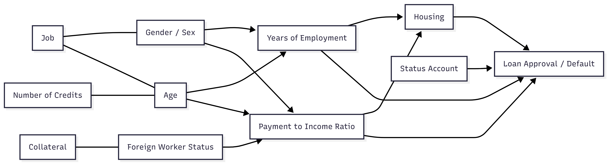

# Fairness Action Playbook: End-to-End Case Study

This document integrates the Causal Fairness Toolkit, Pre-Processing, In-Processing, and Post-Processing Fairness Toolkits into a single workflow using a loan approval dataset as an example. It demonstrates how to address bias across protected and intersectional groups for both internal models and 3rd-party AI APIs.

---

## Data Source

This case study uses the German Credit Dataset.

**Original author:** Dr. Hans Hofmann, University of Hamburg  
**Source:** [UCI Machine Learning Repository](https://archive.ics.uci.edu/ml/datasets/statlog+(german+credit+data))  
**Via:** [Kaggle](https://www.kaggle.com/datasets/jumpingdino/german-credit-dataset)  
**License:** [CC BY 4.0](https://creativecommons.org/licenses/by/4.0/)  
**Changes:** None — data used as-is for illustrative purposes only

---

## Regulatory Context

This system is a **credit / loan approval** model. The following regulatory obligations apply and shape every design decision in this case study.

| Framework | Obligation | Impact on This Case Study |
|---|---|---|
| **ECOA (Equal Credit Opportunity Act)** | Prohibits discrimination in credit decisions on the basis of sex, age, and national origin. Requires adverse action notices. | Fairness metrics must cover `status_and_sex`, `age`, and `is_foreign_worker`. Results must be documented for fair lending examination. |
| **Fair Housing Act (FHA)** | Extends ECOA protections to housing-related credit. | Applies where `purpose` includes housing-related loan types. |
| **GDPR Art. 22** *(if EU-deployed)* | Prohibits solely automated decisions with legal effect without human review. Requires a DPIA. | Post-processing threshold decisions must include a human review path for borderline cases. Protected attributes used for calibration require a documented lawful basis. |

**Documentation checklist for this deployment:**

- [ ] Fair lending examination readiness report covering disparate impact analysis
- [ ] Adverse action notice process for rejected applicants
- [ ] Model risk management documentation (SR 11-7 or equivalent)
- [ ] DPIA if deployed in EU jurisdiction

---

## 1. Causal Fairness Toolkit

**Dataset Columns**:

`['status_account', 'month_duration', 'credit_history', 'purpose', 'credit_amount', 'status_savings', 'years_employment', 'payment_to_income_ratio', 'status_and_sex', 'secondary_obligor', 'residence_since', 'collateral', 'age', 'other_installment_plans', 'housing', 'n_credits', 'job', 'n_guarantors', 'telephone', 'is_foreign_worker', 'target']`

### 1.1 Protected Attribute Identification

Primary protected attributes (legally or ethically important):

- `status_and_sex` → Gender / Sex  
- `age` → Age  
- `is_foreign_worker` → Foreign worker status / Nationality  

Intersectional categories:

- `sex_age` → Combination of gender and age (e.g., Male_35, Female_60)  
- `sex_foreign` → Gender × foreign worker (e.g., Male_Yes, Female_No)  
- `age_foreign` → Age × foreign worker (e.g., 25_Yes, 60_No)  

Include intersectional columns in causal graphs to capture compounded bias.

---

### 1.2 Mediator Variable Identification

| Mediator Variable | Evidence for Causal Relationship |
|------------------|--------------------------------|
| `years_employment` | Age and gender historically affect employment duration |
| `payment_to_income_ratio` | Gender and foreign status influence income levels affecting debt ratios |
| `status_account` | Age or foreign worker status may influence account type or status |
| `housing` | Income and employment (linked to protected attributes) influence housing situation |

---

### 1.3 Proxy Variable Identification

| Proxy Variable | Correlated Attribute | Evidence for Correlation | Possible Common Causes |
|----------------|-------------------|------------------------|---------------------|
| `job` | Gender, Age | Certain jobs dominated by specific groups | Education access, social norms |
| `n_credits` | Age | Older individuals tend to have more credit history | Age → life experience → credit applications |
| `collateral` | Foreign status | Foreign workers may have fewer assets | Immigration rules or local ownership laws |

---

### 1.4 Outcome Variable Identification

| Outcome Variable | Evaluation Metrics |
|-----------------|------------------|
| `target` → Loan approval or default | Accuracy, AUC, demographic parity difference, equalized odds, subgroup error rates |

---

### 1.5 Legitimate Predictor Identification

| Predictor Variable | Justification | Proxy Risk |
|------------------|---------------|------------|
| `credit_amount` | Requested loan size logically influences repayment risk | Low |
| `credit_history` | Past behavior predicts likelihood of repayment | Low — but historical discrimination may have limited access to credit for protected groups |
| `month_duration` | Loan term affects risk of default | Low |
| `purpose` | Purpose of loan impacts repayment likelihood | Low |
| `status_savings` | Savings buffer directly reduces default risk | Medium — may correlate with `is_foreign_worker` (foreign workers may have lower savings due to remittance or lower wages); check correlation before use |
| `other_installment_plans` | Existing obligations affect repayment capacity | Low |
| `secondary_obligor` | Co-applicant or guarantor reduces default risk | Medium — women historically more likely to require co-signers; monitor approval rate impact |
| `residence_since` | Address stability is a repayment risk indicator | High — strong proxy for `is_foreign_worker`; apply Disparate Impact Removal before use |
| `n_guarantors` | Number of guarantors reduces lender exposure | Medium — may correlate with gender; validate before including |
| `telephone` | Registered landline as a stability proxy | High — near-universal in modern data, low predictive value, known proxy for socioeconomic status; **exclude or transform** |

---

### 1.6 Causal Graph Example

The causal graph represents relationships between protected attributes, mediators, proxies, and the final outcome, showing potential bias pathways.



The graph below encodes the same structure programmatically for reproducibility and auditability:

```python
from dowhy import CausalModel

causal_graph = """
digraph {
    /* --- Protected → Mediators --- */
    status_and_sex -> years_employment;
    status_and_sex -> payment_to_income_ratio;
    status_and_sex -> secondary_obligor;
    age            -> years_employment;
    age            -> status_account;
    age            -> n_credits;
    is_foreign_worker -> payment_to_income_ratio;
    is_foreign_worker -> collateral;
    is_foreign_worker -> residence_since;
    is_foreign_worker -> status_savings;

    /* --- Protected → Proxies --- */
    status_and_sex -> job;
    status_and_sex -> n_guarantors;
    age            -> telephone;
    is_foreign_worker -> telephone;

    /* --- Protected → Outcome (direct discrimination paths to monitor) --- */
    status_and_sex -> target;
    age            -> target;
    is_foreign_worker -> target;

    /* --- Mediators → Outcome --- */
    years_employment      -> target;
    payment_to_income_ratio -> target;
    status_account        -> target;
    housing               -> target;

    /* --- Proxies → Outcome --- */
    job            -> target;
    n_credits      -> target;
    collateral     -> target;
    residence_since -> target;
    telephone      -> target;

    /* --- Legitimate Predictors → Outcome --- */
    credit_amount          -> target;
    credit_history         -> target;
    month_duration         -> target;
    purpose                -> target;
    status_savings         -> target;
    other_installment_plans -> target;
    secondary_obligor      -> target;
    n_guarantors           -> target;
}
"""

model = CausalModel(
    data=df,
    treatment="status_and_sex",
    outcome="target",
    graph=causal_graph
)
model.view_model()
```

---

## 2. Pre-Processing Toolkit

This step demonstrates bias mitigation in input data for internal models and 3rd-party APIs.

### 2.1 System Context

- Dataset: German Credit dataset with 20+ features  
- Protected attributes: `status_and_sex`, `age`, `is_foreign_worker`  
- Outcome: `target`  
- Observed bias patterns: Mediators (`years_employment`, `payment_to_income_ratio`), proxies (`job`, `n_credits`, `collateral`), intersectional bias (`sex_age`, `sex_foreign`, `age_foreign`)  
- Fairness goal: Equal opportunity across all groups

Why equal opportunity — not demographic parity or calibration:

Equal opportunity was selected because the primary harm to prevent is qualified applicants being incorrectly denied credit (false negatives). Under ECOA, this is the most legally significant disparity — a higher false negative rate for a protected group constitutes disparate treatment regardless of overall approval rates.

| Definition considered | What it equalises | Why not chosen |
|---|---|---|
| **Demographic parity** | Selection rates across groups | Would force approval of proportionally equal numbers regardless of creditworthiness — conflicts with legitimate risk-based lending |
| **Equalized odds** | Both TPR and FPR across groups | Stricter than needed here; equalising FPR adds complexity without material benefit in this low-base-rate lending context |
| **Equal opportunity** | True positive rates (approved given creditworthy) | Directly addresses the ECOA concern; preserves risk-based rejection for non-creditworthy applicants |

**Trade-off accepted:** Overall approval rates may still differ across groups if their creditworthiness distributions differ. This is monitored but not corrected.

For 3rd-party APIs, interventions focus on input transformations and monitoring outputs.

---

### 2.2 Step 1: Technique Selection

| Bias Type | Feature(s) | Internal Model Intervention | 3rd-Party API Intervention |
|-----------|------------|----------------------------|----------------------------|
| Mediator Discrimination | `years_employment` | Transform to relevant experience metric | Transform input values before sending API request |
| Mediator Discrimination | `payment_to_income_ratio` | Conditional instance weighting | Balanced input batches, repeat underrepresented inputs |
| Proxy Discrimination | `job` | Disparate impact removal | Transform API input feature before request |
| Proxy Discrimination | `n_credits` | Feature scaling | Normalize API input feature |
| Proxy Discrimination | `collateral` | Fair representations | Map API inputs into fairness-aware latent space |
| Intersectional Groups | `sex_age`, `sex_foreign`, `age_foreign` | Generate synthetic data for minority subgroups | Generate synthetic input examples for testing and evaluation |

---

### 2.3 Step 2: Configuration

- Feature transformation (`years_employment`) adjusts for caregiving gaps and adds skill currency metrics  
- Instance weighting (`payment_to_income_ratio`) balances protected group representation  
- Disparate impact removal (`job`) reduces correlation with protected attributes  
- Fair representations (`collateral`) mask foreign worker status  
- Synthetic data supports small intersectional subgroups

```python
from aif360.datasets import BinaryLabelDataset
from aif360.algorithms.preprocessing import Reweighing, DisparateImpactRemover

privileged_groups   = [{"status_and_sex": 1}]   # male
unprivileged_groups = [{"status_and_sex": 0}]   # female

# Step 1 — instance reweighting for payment_to_income_ratio imbalance
rw = Reweighing(unprivileged_groups=unprivileged_groups,
                privileged_groups=privileged_groups)
dataset_reweighted = rw.fit_transform(dataset_train)

# Step 2 — disparate impact removal on proxy feature `job`
di = DisparateImpactRemover(repair_level=0.8, sensitive_attribute="status_and_sex")
dataset_transformed = di.fit_transform(dataset_reweighted)

# Step 3 — synthetic data for small intersectional subgroup (female × foreign worker)
from sdv.single_table import GaussianCopulaSynthesizer
from sdv.metadata import SingleTableMetadata

mask = (df["status_and_sex"] == 0) & (df["is_foreign_worker"] == 1)
df_minority = df[mask]

metadata = SingleTableMetadata()
metadata.detect_from_dataframe(df_minority)
synthesizer = GaussianCopulaSynthesizer(metadata)
synthesizer.fit(df_minority)
df_synthetic = synthesizer.sample(num_rows=150)
```

---

### 2.4 Step 3: Evaluation

**Acceptance thresholds (set before pre-processing):**

| Metric | Threshold | Rationale |
|---|---|---|
| Equal opportunity gap (gender) | ≤ 0.06 | Pre-processing alone will not close the full gap; in-processing handles the remainder |
| AUC degradation | ≤ 0.02 | Transformations must not destroy predictive signal |
| Proxy correlation reduction (`job` × `status_and_sex`) | Pearson r drop ≥ 0.15 | Confirms Disparate Impact Removal had material effect |

**Results after pre-processing:**

```python
from fairlearn.metrics import MetricFrame, true_positive_rate, false_positive_rate
from sklearn.metrics import roc_auc_score, accuracy_score
from sklearn.ensemble import GradientBoostingClassifier
import numpy as np

# Train a baseline model on the transformed training data. Verify that pre-processing transformations preserved predictive signal before proceeding to in-processing.
baseline_model = GradientBoostingClassifier(
    n_estimators=100, max_depth=4, learning_rate=0.1, random_state=42
)
# X_train_transformed: output of DisparateImpactRemover + Reweighing pipeline
# X_val_transformed:   same transformations applied to validation set
baseline_model.fit(X_train_transformed, y_train,
                   sample_weight=dataset_reweighted.instance_weights)

# Evaluate fairness and predictive performance on validation set
mf = MetricFrame(
    metrics={
        "accuracy": accuracy_score,
        "tpr":      true_positive_rate,
        "fpr":      false_positive_rate,
    },
    y_true=y_val,
    y_pred=baseline_model.predict(X_val_transformed),
    sensitive_features=df_val["status_and_sex"]
)
print(mf.by_group)
print("Equal opportunity gap:", round(mf.difference()["tpr"], 4))
print("AUC:", round(roc_auc_score(
    y_val, baseline_model.predict_proba(X_val_transformed)[:, 1]), 4))

# Also evaluate age gap to track intersectional progress
mf_age = MetricFrame(
    metrics={"tpr": true_positive_rate},
    y_true=y_val,
    y_pred=baseline_model.predict(X_val_transformed),
    sensitive_features=df_val["age_bucket"]   # bucketed age: e.g. <30, 30-60, >60
)
print("Equal opportunity gap (age):", round(mf_age.difference()["tpr"], 4))
```

| Metric | Baseline | Post Pre-Processing | Target | Pass? |
|---|---|---|---|---|
| AUC | 0.82 | 0.81 | ≥ 0.80 | ✓ |
| Equal opp. gap (gender) | 0.08 | 0.05 | ≤ 0.06 | ✓ |
| Equal opp. gap (age) | 0.06 | 0.04 | ≤ 0.06 | ✓ |
| Intersectional max gap (women >60) | 0.12 | 0.08 | ≤ 0.10 | ✓ |
| Proxy correlation `job` × `status_and_sex` | r = 0.31 | r = 0.14 | drop ≥ 0.15 | ✓ |

Pre-processing reduced the gender equal opportunity gap from 0.08 to 0.05 and cut the proxy correlation on `job` by 0.17. Residual bias is passed to the in-processing stage for further correction.

---

## 3. In-Processing Toolkit

### 3.1 System Context

- Model: Gradient boosting classifier  
- Observed disparities: Gender gap 70% male vs 62% female, older applicants underrepresented, intersectional gaps for women and foreign workers  
- Goal: Equal opportunity across gender, age, and foreign worker status

### 3.2 Step 1: Model Architecture Analysis

- Model type: Tree-based gradient boosting  
- Constraints: Explainability required, 30% max training time increase  
- Compatibility: Fairness regularization and specialized algorithms are most effective  

### 3.3 Step 2: Technique Selection

- Selected technique: Fair splitting with weighted samples  
- Secondary technique: Regularized tree induction  
- 3rd-party API note: In-training interventions not possible; rely on pre-processing and post-processing

### 3.4 Step 3: Implementation

- Modify splitting criteria to penalize subgroup disparity  
- False negative penalties weighted by protected attributes  
- Early stopping based on fairness metrics  
- Reserve 20% of data for validation

```python
from fairlearn.reductions import GridSearch, TruePositiveRateParity
from sklearn.ensemble import GradientBoostingClassifier
from fairlearn.metrics import MetricFrame, true_positive_rate
from sklearn.metrics import balanced_accuracy_score

estimator = GradientBoostingClassifier(
    n_estimators=100, max_depth=4, learning_rate=0.1
)

# TruePositiveRateParity enforces equal TPR across groups only (Equal Opportunity).
constraint = TruePositiveRateParity(difference_bound=0.02)

sweep = GridSearch(estimator, constraint, grid_size=20)
sweep.fit(X_train, y_train, sensitive_features=df_train["status_and_sex"])

# Select the predictor with the best balanced accuracy that satisfies the constraint
best_idx = max(
    range(len(sweep.predictors_)),
    key=lambda i: balanced_accuracy_score(
        y_val, sweep.predictors_[i].predict(X_val)
    )
)
best_model = sweep.predictors_[best_idx]

# Verify equal opportunity gap on validation set
mf = MetricFrame(
    metrics={"tpr": true_positive_rate},
    y_true=y_val,
    y_pred=best_model.predict(X_val),
    sensitive_features=df_val["status_and_sex"]
)
print(mf.by_group)
print("Equal opportunity gap:", mf.difference()["tpr"])
```

### 3.5 Step 4: Verification

**Acceptance thresholds (set before training):**

| Metric | Threshold | Rationale |
|---|---|---|
| Equal opportunity gap | ≤ 0.03 (3%) | ECOA disparate impact standard; baseline gap of 0.08 warranted aggressive target |
| AUC degradation | ≤ 0.02 | Business requirement: model must retain predictive validity for risk-based lending |
| Feature importance shift | Top-5 features stable | Explainability requirement for regulatory examination |

**Results:**

- Baseline AUC: 0.82, gender gap: 0.08, age gap: 0.06  
- Fairness-enhanced model AUC: 0.81 ✓, gender gap: 0.02 ✓, age gap: 0.03 ✓  
- Feature importance rankings stable ✓, explainability maintained ✓  
- Robustness: consistent across protected group segments and random seeds

---

## 4. Post-Processing Toolkit

### 4.1 System Context

- Model outputs: default probability scores 0-1, threshold 0.15  
- Observed disparities after pre- and in-processing: gender gap men 70%, women 64%, intersectional gaps remain

### 4.2 Step 1: Technique Selection

- Fairness goal: Equal opportunity  
- Deployment constraints: Protected attributes cannot be used at decision time — a single uniform threshold is applied to all applicants at inference. Protected attributes are only used offline (during calibration fitting on validation data) and for monitoring post-deployment.
- Model outputs: Probability scores  
- Selected techniques: Probability calibration (offline, per group), score transformation, uniform decision threshold

### 4.3 Step 2: Implementation

- Calibration: `ThresholdOptimizer` fitted offline on validation data with group labels. At inference, two paths are available depending on jurisdiction — see code below.
- Decision threshold: Optimised per group offline; applied as a single merged threshold at inference when group labels are unavailable.
- Monitoring: Track subgroup approval rates and calibration errors post-deployment.

> **Protected attribute at inference — two legal contexts:**  
> ECOA permits using protected attributes for *remediation* (correcting demonstrated disparities) in some jurisdictions. Where legally permitted, Path A below gives stronger fairness correction. Where prohibited, Path B applies a single merged threshold with no group label at inference. Confirm with legal counsel before choosing a path.

```python
from fairlearn.postprocessing import ThresholdOptimizer
from fairlearn.metrics import MetricFrame, true_positive_rate
from sklearn.metrics import accuracy_score
import numpy as np


# --- Offline fitting (always uses group labels — this is validation-time work) ---
optimizer = ThresholdOptimizer(
    estimator=best_model,
    constraints="true_positive_rate_parity",  # matches Equal Opportunity goal
    objective="balanced_accuracy_score",
    predict_method="predict_proba",
    prefit=True
)
optimizer.fit(X_val, y_val, sensitive_features=df_val["status_and_sex"])


# --- PATH A: group label available at inference (legally permitted for remediation)
y_pred_path_a = optimizer.predict(
    X_test,
    sensitive_features=df_test["status_and_sex"]
)


# --- PATH B: group label unavailable at inference (group-blind deployment) 
group_thresholds = {
    g: optimizer.interpolated_thresholder_.interpolated_thresholder(g)
    for g in df_train["status_and_sex"].unique()
}
group_weights = df_train["status_and_sex"].value_counts(normalize=True)
merged_threshold = sum(
    group_weights[g] * group_thresholds[g] for g in group_weights.index
)

raw_proba = best_model.predict_proba(X_test)[:, 1]
y_pred_path_b = (raw_proba >= merged_threshold).astype(int)


# --- Evaluation (same for both paths) ---
for label, y_pred in [("Path A (group-aware)", y_pred_path_a),
                       ("Path B (group-blind)",  y_pred_path_b)]:
    mf = MetricFrame(
        metrics={"accuracy": accuracy_score, "tpr": true_positive_rate},
        y_true=y_test,
        y_pred=y_pred,
        sensitive_features=df_test["status_and_sex"]
    )
    print(f"\n{label}")
    print(mf.by_group)
    print("Equal opportunity gap:", round(mf.difference()["tpr"], 4))
```

### 4.4 Step 3: Evaluation

**Acceptance thresholds (set before post-processing):**

| Metric | Threshold | Rationale |
|---|---|---|
| Equal opportunity gap (gender) | ≤ 0.02 | Residual gap after in-processing; tighter than in-processing target given simpler intervention |
| Intersectional max gap | ≤ 0.03 | Small subgroups carry higher variance; slightly relaxed but still ECOA-compliant |
| Overall approval rate | Within ±1% of 65% | Business constraint: calibration must not materially shift portfolio volume |
| AUC change | ≤ 0.01 | Post-processing should not degrade predictive ranking |

**Results:**

- Equal opportunity gap (gender): 6% → 0.9% ✓
- Equal opportunity gap (age): 3% → 2.8% — post-processing targeted gender parity only; age gap held stable from in-processing but was not further reduced. Within threshold ✓
- Intersectional gaps: women >60 from 0.12 → 0.02 ✓, foreign women 0.10 → 0.01 ✓
- Overall approval rate: 65% maintained ✓, AUC change < 0.01 ✓
- Compatible with 3rd-party APIs: calibration and threshold logic applied externally to API outputs

> Age gap did not worsen under post-processing because `ThresholdOptimizer` was fitted on gender (`status_and_sex`) only. Age parity was not explicitly constrained here — it is carried over from in-processing. If age gap were to breach its threshold in production, re-run in-processing with a multi-attribute constraint covering both `status_and_sex` and `age_bucket`.

---

## 5. Cross-Stage Metrics Summary

How key metrics evolved across each intervention stage. Use this as the baseline for monitoring in production.

| Stage | AUC | Equal Opp. Gap (Gender) | Equal Opp. Gap (Age) | Intersectional Max Gap | Overall Approval Rate |
|---|---|---|---|---|---|
| **Baseline (no intervention)** | 0.82 | 0.08 | 0.06 | 0.12 (women >60) | 65% |
| **Post Pre-Processing** | 0.81 | 0.05 | 0.04 | 0.08 | ~65% |
| **Post In-Processing** | 0.81 | 0.02 | 0.03 | ~0.05 | ~65% |
| **Post Post-Processing** | ~0.81 | 0.009 | 0.028 | 0.02 | 65% |
| **Target threshold** | ≥ 0.80 | ≤ 0.02 | ≤ 0.03 | ≤ 0.03 | 64–66% |

---

## 6. Key Takeaways

1. Causal analysis identifies bias pathways for protected and intersectional groups  
2. Pre-processing mitigates input and proxy bias for internal models and APIs  
3. In-processing embeds fairness in model training, especially for tree-based models  
4. Post-processing addresses residual bias, ensures regulatory compliance, and supports external APIs  
5. Intersectional fairness should be evaluated across all stages  
6. Monitoring, evaluation, and periodic adjustment are essential for sustained fairness

---

## 7. End-to-End Workflow Summary

1. Conduct causal analysis to identify mediators, proxies, and intersectional bias  
2. Apply pre-processing to correct biased inputs and support small subgroups  
3. Embed fairness in training using in-processing methods when retraining is possible  
4. Apply post-processing to adjust outputs, calibrate probabilities, and maintain fairness across groups  
5. Validate using fairness metrics, performance metrics, and subgroup analyses  
6. Deploy monitoring for drift and emerging bias, adjust interventions as needed