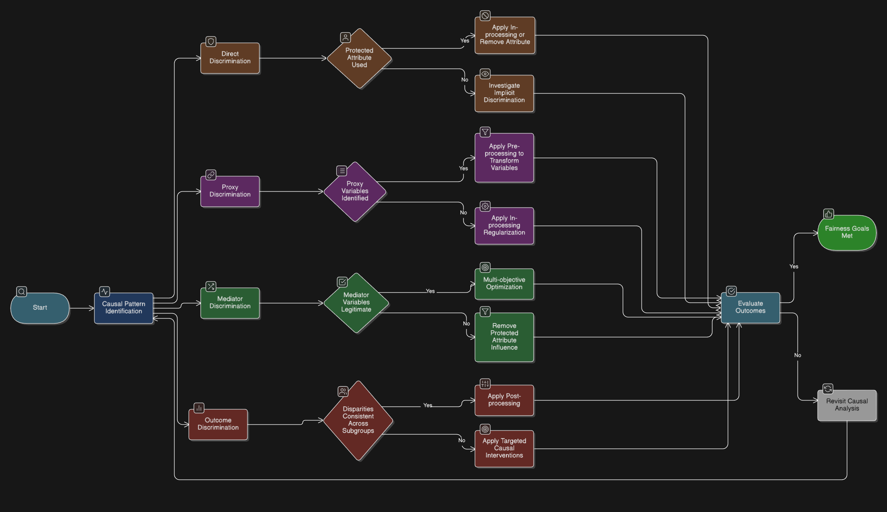

# Causal Analysis

## Overview

The Causal Analysis toolkit maps the relationships between variables in an AI system to identify where bias originates and where interventions will be most effective. Unlike statistical correlation analysis, causal analysis distinguishes between protected attributes, mediators, proxies, and legitimate predictors — enabling teams to target the root cause of unfairness rather than treating symptoms.

Use this toolkit before selecting pre-processing, in-processing, or post-processing interventions. Causal findings directly determine which toolkit to apply and at which pipeline stage.

The toolkit covers both internal models (where causal graphs can be constructed from training data) and 3rd-party APIs (where the model is a black box and interventions must occur at the input and output boundaries).

## 1. Causal Modeling Template

Guides users in mapping causal relationships and identifying protected, mediator, proxy, outcome, and legitimate predictor variables.  

### 1.1 Protected Attribute Identification

- Primary protected attributes: 
  List legally/ethically important features (e.g., gender, age, nationality).

- Intersectional categories:  
  Combine attributes to capture compounded bias (e.g., `gender × age`, `gender × nationality`).

#### Internal Models
- Include protected attributes in the causal graph directly.  
- Include intersectional columns to detect bias across multiple groups.

#### 3rd-Party APIs
- Identify protected attributes in internal data and any proxies captured by API inputs (e.g., ZIP code, free text, names).  
- Track intersectional effects at the system level.

---

### 1.2 Mediator Variable Identification

#### Internal Models
- Variables directly influenced by protected attributes (e.g., income, employment history).  
- Evidence for causal relationships should come from domain knowledge, historical data, or prior studies.

#### 3rd-Party APIs
- Track mediators feeding into API inputs.  
- Evaluate if outputs amplify disparities or introduce bias.

---

### 1.3 Proxy Variable Identification

#### Internal Models
- Variables correlated with protected attributes but not directly caused by them.  
- Document correlation evidence and common causes.

#### 3rd-Party APIs
- Any input variable that acts as a proxy for protected attributes should be flagged for pre-processing or mitigation before API call.

---

### 1.4 Outcome Variable Identification

#### Internal Models
- Decisions or predictions produced by the system (e.g., loan approval).  
- Evaluation metrics: demographic parity, equalized odds, path-specific fairness measures.

#### 3rd-Party APIs
- Outcomes include API outputs and final business decisions.  
- Evaluate fairness at both levels.

---

### 1.5 Legitimate Predictor Identification

#### Internal Models
- Variables that should influence outcomes (e.g., credit score, repayment history).  
- Provide justification for inclusion.

#### 3rd-Party APIs
- Inputs allowed to influence API outputs can still be evaluated for fairness impact.  
- Document assumptions about API behavior.

---

## 2. Causal Graph Construction Guidelines

#### Internal Models
- Use directed arrows for causal relationships.  
- Use bidirectional dashed arrows for correlations without direct causation.  
- Distinguish protected attributes, mediators, proxies, and outcomes.  
- Document assumptions and critical paths.  
- Library: `dowhy` or `networkx` for programmatic graph construction

```python
import networkx as nx
from dowhy import CausalModel

# Define causal graph using DOT notation
causal_graph = """
digraph {
    sex -> income;
    sex -> loan_approved;
    age -> income;
    age -> loan_approved;
    income -> loan_approved;
    credit_score -> loan_approved;
}
"""

model = CausalModel(
    data=df,
    treatment="sex",
    outcome="loan_approved",
    graph=causal_graph
)
model.view_model()   # renders the DAG
```

#### 3rd-Party APIs
- Represent the API as a black-box node.  
- Document assumptions about vendor behavior, input-output correlations, and unknown internal logic.  
- Identify paths where the API could amplify bias.

---

## 3. Counterfactual Analysis Framework

Evaluates whether the system exhibits causal discrimination by analyzing predictions under hypothetical changes to protected attributes.

#### Internal Models
- Change protected attribute values and recompute model outputs.  
- Evaluate path-specific effects (NDE/NIE) and intersectional subgroups.
- Library: `dowhy`

```python
from dowhy import CausalModel

model = CausalModel(
    data=df,
    treatment="sex",            # protected attribute
    outcome="loan_approved",    # decision variable
    common_causes=["age", "income", "credit_score"]
)

identified_estimand = model.identify_effect()
estimate = model.estimate_effect(
    identified_estimand,
    method_name="backdoor.linear_regression"
)
refute = model.refute_estimate(estimate, method_name="random_common_cause")
print(estimate)   # Average Treatment Effect (ATE) of sex on loan approval
```

#### 3rd-Party APIs
- Use behavioral counterfactual testing:  
  1. Hold non-protected features constant.  
  2. Modify protected attributes (or proxies).  
  3. Call the API.  
  4. Compare outputs for bias detection.

```python
def counterfactual_api_test(api_fn, sample: dict, attribute: str, values: list):
    """Send same record with flipped protected attribute, compare outputs."""
    results = {}
    for val in values:
        modified = {**sample, attribute: val}
        results[val] = api_fn(modified)
    return results

# Example usage
outputs = counterfactual_api_test(
    api_fn=my_api_call,
    sample={"age": 35, "income": 50000, "zip": "10001", "sex": 1},
    attribute="sex",
    values=[0, 1]
)
disparity = abs(outputs[1] - outputs[0])
print(f"Counterfactual disparity: {disparity:.4f}")
```

---

## 4. Path-Specific Effect Analysis

#### Internal Models
- Quantify the contribution of each causal path to observed disparities.  
- Visualize with diagrams or tables.  
- Focus interventions on problematic paths while preserving legitimate paths.

#### 3rd-Party APIs
- Measure disparity before API, within API outputs, and after post-processing.  
- Determine where mitigation is most effective (input pre-processing vs. output post-processing).

---

## 5. Intervention Point Identification Method

Determines where in the ML pipeline interventions should occur. Identify which discrimination type applies, then follow the guidance for your model context.

### 5.1 Direct Discrimination (Protected Attribute → Outcome)

The protected attribute influences the outcome directly or explicitly.

#### Internal Models
- Attribute used explicitly → remove the feature or apply in-processing fairness constraints.  
- Attribute not used explicitly → investigate implicit paths via causal graph.

#### 3rd-Party APIs
- Cannot modify internal logic; remove protected attributes and known proxies from API inputs before the call.

---

### 5.2 Proxy Discrimination (Via Correlated Variables)

A non-protected variable is highly correlated with the protected attribute and acts as a substitute pathway.

#### Internal Models
- Proxy identified → apply pre-processing transformations (e.g., Disparate Impact Removal).  
- Proxy not yet identified → apply in-processing regularization to reduce learned correlation.

#### 3rd-Party APIs
- Apply pre-processing transformations to inputs to reduce proxy influence before the API call.  
- Apply post-processing adjustments to API outputs for any residual disparity.

---

### 5.3 Mediator Discrimination (Via Causally Influenced Features)

A variable is caused by the protected attribute and also influences the outcome (e.g., income caused by gender).

#### Internal Models
- Mediator is a legitimate predictor → use multi-objective optimization to balance fairness and predictive utility.  
- Mediator is not a legitimate predictor → apply pre-processing to remove bias before training.

#### 3rd-Party APIs
- Pre-process or neutralize mediator values before the API call.  
- Apply post-processing if mediator influence persists in outputs.

---

### 5.4 Outcome Discrimination (Disparities in Outputs)

Observed disparities appear directly in model predictions or decisions, regardless of identified root cause.

#### Internal Models
- Apply post-processing thresholds or group-specific calibration adjustments to correct residual disparities.

#### 3rd-Party APIs
- Adjust decision thresholds after receiving API outputs.  
- Add a human review or business logic layer to enforce fairness at the decision point.

---

### Example



---

## 6. Integration and Validation Guidance

#### Internal Models
- Map causal findings to pre-, in-, and post-processing interventions.  
- Validate using metrics (demographic parity, equalized odds, path-specific fairness, accuracy, RMSE, AUC).  
- Include intersectional subgroup analysis.  
- Monitor for bias drift post-deployment.

#### 3rd-Party APIs
- Track both API outputs and final decision fairness.  
- Validate with multiple input-output test scenarios.  
- Monitor API versions and re-test fairness after updates.  
- Document corrective actions if external API behavior introduces disparities.

---

## See Also

- [Pre-Processing Methods](./pre_processing.md) — apply findings from causal analysis to data-level interventions
- [Fairness Action Playbook — Overview](./fairness_action_playbook_intro.md) — decision checklist mapping bias type to toolkit
- [Loan Approval Case Study — Causal Analysis](../../case_studies/loan_approval_fairness_e2e_case.md#1-causal-fairness-toolkit) — worked example with `dowhy` causal graph for the German Credit dataset