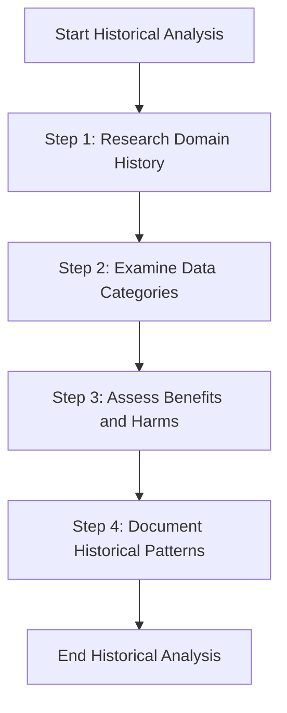

# Context & History Analysis

## Overview

This section examines the historical, social, and organisational factors that may affect how the AI system was designed and deployed and how it behaves. It focuses on past decisions, data sources, and known patterns of bias. Understanding historical context helps teams recognize embedded assumptions, identify potential fairness risks early, and avoid repeating mistakes that have already occurred in similar contexts.

**Context & History Analysis** is most critical in domains where data is shaped by long-standing institutional and structural biases. In areas such as policing, housing policy, education, and migration control, past decisions directly influence present-day datasets and system behavior.

## 1. How to Use This Component

To support teams in conducting effective historical context assessments, consider the following practices:

- **Collaborate with domain experts** who understand the historical context. If you don't have in-house expertise, consider: academics or researchers in the relevant field, community organisations representing affected groups, NGOs with domain experience, or public reports and regulatory guidance as a starting point for smaller teams.
- **Create accessible resources** summarising key historical patterns for commonly used applications.
- **Develop standard templates** to guide non-historians through essential questions.

## 2. Intersectionality in Historical Context Assessment

**Why It Matters:**

Intersectionality captures compounded biases from overlapping identities (e.g., race and gender) that single-axis analyses often miss. Incorporating intersectional perspectives ensures a more complete understanding of historical inequities and strengthens fairness evaluations.

**Key Benefits:**

- Reveal Compounded Harms
    - Historical data can encode overlapping discrimination. For example, 18th-century newspapers disproportionately described Black women as “poor” or “deceased” compared to White women. Ignoring these patterns risks perpetuating compounded biases in AI systems.
- Reflect Power Imbalances Accurately
    - Intersectional analysis exposes systemic inequities. Tools like COMPAS misclassified Black defendants as high-risk more often than White defendants, reflecting overlapping racial and socioeconomic biases.
- Enable Targeted Remediation
    - Insights guide precise interventions. Resume-screening AI, for instance, ranked “Latina-sounding” names lower for women than men, highlighting a race-gender intersection that single-axis analysis would miss.

**Implementation Guidance:**

- Audit data for intersectional groups, not just individual protected attributes.
- Apply metrics that measure disparities across combinations of attributes (e.g., gender × race, age × disability).
- Document and prioritize intersectional risks alongside single-axis biases to ensure interventions are holistic, actionable, and ethically grounded.

## 3. Implementation Framework

### 3.a Historical Context Assessment Questionnaire

The table below provides a structured framework for conducting historical context assessments. Teams should answer each question based on their investigation, document findings in the Results column, and define follow-up steps in the Actions column.

| **Category** | **Question** | **Focus** | **Purpose** |
| --- | --- | --- | --- |
| **Historical Pattern Identification** | 1.Examine historical discrimination in the specific domain: | The *existence and patterns of discrimination* in the real-world domain (healthcare, hiring, criminal justice, etc.). | Understand what groups have historically been disadvantaged or treated unfairly. |
|  | 2. Research how previous technologies in this domain have reflected, reinforced, or challenged existing social hierarchies | The *role of technology itself* in shaping or responding to social inequalities. | Learn whether earlier tools, software, or systems *amplified*, *reduced*, or had *no effect* on existing biases. |
|  | 3. Identify recurring mechanisms through which bias has persisted across technological transitions in this domain | *Patterns or processes* by which bias survives, even as technology changes. | Spot systematic mechanisms that cause unfair outcomes repeatedly, so your AI system can avoid them. |
| **Pattern-to-Risk Mapping** | 1. Map identified historical patterns to specific components of the ML system under consideration | Connect real-world historical bias or patterns to the *specific parts of the AI/ML system* (data, features, model, evaluation). | Identify which parts of the system might be influenced by past inequities. |
|  | 2. Determine how historical classification systems might influence feature definitions and encodings | Examine how *previous ways of categorizing or labeling data* could impact how features are constructed. | Understand if the way data is labeled or grouped perpetuates bias in the model. |
|  | 3. Assess how historical performance disparities might manifest in model accuracy across groups | Analyze whether past inequities might lead to *unequal model performance* for different demographic groups. | Identify potential fairness risks in predictions or outcomes. |
|  | 4. Analyze how historical optimization priorities might shape evaluation metrics and thresholds | Look at how *past goals or optimization choices* could influence current evaluation criteria. | Ensure that evaluation metrics do not inadvertently reproduce historical biases. |
| **Prioritization Framework** | 1. Assess the strength of the historical connection between identified patterns and the current application | Measure how closely past biases or patterns relate to the AI system being developed. | Identify which historical patterns are most likely to affect the current system. |
|  | 2. Evaluate the potential harm if historical patterns were to recur in the current system | Consider the impact of bias on affected groups if it appears in the new system. | Determine which patterns could cause the most serious consequences. |
|  | 3. Determine the visibility of potential bias | Assess how obvious or detectable a bias might be to stakeholders or users. | Bias that is hidden or subtle may require more careful monitoring. |
|  | 4. Prioritize which historical patterns require particular attention in subsequent fairness assessments | Rank patterns based on relevance, potential harm, and visibility. | Focus efforts on the most critical risks to guide audits and mitigation strategies. |

### 3.b Matrix Components

1. **Historical Pattern**: Specific documented pattern of discrimination with historical evidence.
2. **Severity**: Impact of this bias if perpetuated (High/Medium/Low):
    - High: Directly impacts fundamental rights or life outcomes.
    - Medium: Creates significant disparities in opportunities or resources.
    - Low: Creates differential experiences but with limited material impact.
3. **Likelihood**: Probability of this pattern manifesting in AI systems:
    - High: Pattern frequently appears in similar systems.
    - Medium: Pattern occasionally appears in similar systems.
    - Low: Pattern rarely appears in similar systems.
4. **Relevance**: Applicability to the specific AI system being developed:
    - High: Direct applicability to system's domain/purpose.
    - Medium: Partial applicability to certain system components.
    - Low: Limited applicability but potential for manifestation.
5. **Priority Score**: Calculated as Severity + Likelihood + Relevance (sum, max = 9):
    - 7–9: Critical — Requires immediate mitigation.
    - 5–6: High — Requires mitigation before launch.
    - 3–4: Medium — Monitor after launch.
    - 1–2: Low — No action needed.

### 3.c Historical Analysis Evaluation Checklist

#### Coverage

| # | Check | If unchecked → |
| --- | --- | --- |
| 1 | The analysis examines multiple historical periods, not just recent precedents. | Extend research to earlier periods; consult academic sources or domain experts. |
| 2 | Assessment covers various discrimination mechanisms, not just the most obvious forms. | Revisit the questionnaire — hidden mechanisms (e.g., proxy variables, structural exclusion) are often higher risk. |
| 3 | Intersectional considerations are addressed; protected attributes are not treated in isolation. | Re-run the analysis with combined attributes (e.g., race × gender). |

#### Connection

| # | Check | If unchecked → |
| --- | --- | --- |
| 4 | Identified historical patterns have clear connections to the current application. | Remove patterns with no system link; flag as background context only. |
| 5 | Mapped risks are specific to system components, not just general concerns. | Re-map vague risks to concrete components (data, features, model, evaluation). |
| 6 | Prioritisation decisions are justified by evidence, not assumptions. | Document the source for each score; unsupported scores default to Medium. |

#### Actionability

| # | Check | If unchecked → |
| --- | --- | --- |
| 7 | Analysis produces actionable insights for subsequent fairness work. | If no actionable insight exists, mark the pattern as Low priority. |
| 8 | Identified historical patterns inform concrete assessment approaches. | Link each pattern to a specific bias type in the Bias Source Identification component. |
| 9 | Analysis suggests specific monitoring metrics based on historical patterns. | Add at least one metric per Critical/High priority pattern before proceeding. |

## 4. Output Template

Use this table to record findings after completing the questionnaire and risk classification. One row per identified historical pattern.

| Historical Pattern | Evidence / Source | System Components Affected | Severity (1–3) | Likelihood (1–3) | Relevance (1–3) | Priority Score (Sum) | Priority Level | Recommended Action |
| --- | --- | --- | --- | --- | --- | --- | --- | --- |
| | | | | | | | | |
| | | | | | | | | |
| | | | | | | | | |

Priority levels: 7–9 = Critical · 5–6 = High · 3–4 = Medium · 1–2 = Low

---

## 5. Usage Guide

### Implementation Process

**Step 1 & Step 2: Domain Research and Questionnaire Completion (2-4 hours)**

1. Gather historical information specific to your application domain.
2. Focus on documented patterns of discrimination and their mechanisms.
3. Review relevant academic literature, legal cases, and domain-specific resources.
4. Assemble a diverse team including domain experts and stakeholders.
5. Work through the questionnaire sections sequentially.
6. Document answers with specific examples and sources where possible.
7. For questions without clear answers, note information gaps for further research.

**Step 3: Risk Classification (30-60 minutes)**

1. Use the risk classification matrix to categorize identified historical patterns.
2. For each risk, document:
    - Specific historical pattern
    - System components affected
    - Potential impact severity
    - Likelihood based on system design
    - Priority level for intervention

**Step 4: Documentation and Integration (1-2 hours)**

1. Compile findings into a structured historical context assessment document.
2. Highlight critical and high-priority risks that require immediate attention.
3. Create actionable recommendations for subsequent design and development phases.
4. Feed results into the fairness definition selection process.