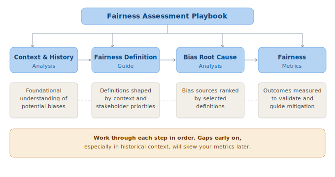

# Fairness Assessment Playbook

This playbook can be used by teams completely new to fairness assessments and by teams that have already applied fairness tools during implementation. Some components may be deprioritized based on what is already in place, but reviewing all components at a high level is strongly recommended.

## Playbook Structure

1. Flow and Dependencies
2. Overview
    1. Context & History Analysis
    2. Fairness Definition Guide
    3. Bias Root Cause Analysis
    4. Fairness Metrics
3. Time and Resource Estimation
4. Intersectionality
5. Assessment Lifecycle
6. Recommendations

---

## 1. Flow and Dependencies

---

## 2. Overview

### 2.a. Context & History Analysis

Examines historical, social, and organizational factors that shaped the AI system's design and data. Helps teams recognize embedded assumptions and identify fairness risks early. Outputs feed directly into fairness definition selection, bias root cause analysis, and metric choice.

---

### 2.b. Fairness Definition Guide

Guides teams through selecting, applying, and monitoring fairness definitions. Ensures historical context informs which definitions are most relevant, documents trade-offs, and aligns fairness goals with stakeholder priorities and error impact.

---

### 2.c. Bias Root Cause Analysis

Categorizes potential bias sources, applies structured detection methods, and prioritizes interventions by impact and feasibility. Relies on outputs from the two prior components to focus effort where it matters most.

---

### 2.d. Fairness Metrics

Guides selection of appropriate fairness metrics, statistical validation, and visualization. Ensures metrics reflect chosen fairness definitions, account for historical bias, and can be communicated clearly across demographic and intersectional groups.

---

## 3. Time and Resource Estimation

| Module | Low Complexity | High Complexity | Key Roles |
| --- | --- | --- | --- |
| Context & History Analysis | 3–5 h | 8–12 h | Domain expert, ethics reviewer |
| Fairness Definition Guide | 2–4 h | 6–8 h | Domain expert, data scientist |
| Bias Root Cause Analysis | 5–8 h | 12–16 h | ML engineer, data scientist, domain expert |
| Fairness Metrics | 3–5 h | 8–10 h | ML engineer, statistician |
| Total | 13–22 h | 34–46 h | |

Low complexity: Simple classifier, low-risk domain, small team, existing documentation.
High complexity: Multi-modal or LLM-based system, high-risk domain (healthcare, credit, hiring), limited prior documentation.

**Scale the effort to your organisation.** These estimates are not a one-size-fits-all requirement. A two-person startup shipping a low-risk feature does not need the same process as a global enterprise deploying AI in hiring or healthcare. The goal is proportionate, meaningful fairness work — not compliance theatre. Use the table below as a starting point:

| Organisation Type | Suggested Approach |
| --- | --- |
| Startup / small team (< 20 people) | Focus on Bias Root Cause Analysis and Fairness Metrics. Use the Context & History Analysis as a lightweight checklist (1–2 h). Skip formal governance artefacts until the system reaches scale. |
| Mid-size company (20–200 people) | Run all 4 components. Assign a part-time Fairness Champion. Automate metric checks in CI/CD early. |
| Large / enterprise (200+ people) | Full audit with dedicated roles. Integrate with governance frameworks and regulatory compliance requirements. |

If you are unsure where to start, begin with Bias Root Cause Analysis — it produces the most immediate, actionable findings regardless of team size.

---

## 4. Intersectionality

Intersectionality means examining overlapping identities (e.g., race × gender, age × disability) rather than single attributes in isolation. Bias that is invisible on a single axis often becomes visible at intersections.

**Apply this throughout every component:**

- Audit data, features, and model outputs across intersectional subgroups — not just individual protected attributes.
- Apply fairness metrics (demographic parity, equal opportunity, equalized odds) to intersectional groups.
- Flag small subgroup sizes and use statistical techniques (Bayesian estimation, bootstrapping) to handle them.
- Include intersectional breakdowns in all reports and dashboards.

Each component in this playbook references intersectional considerations in its specific context. This section is the shared foundation.

---

## 5. Assessment Lifecycle

A fairness Assessment is not a one-time activity. AI systems drift as data, users, and context change.

| Trigger | Action |
| --- | --- |
| Before initial deployment | Full Assessment across all 4 components |
| Major model retraining | Re-run Bias Root Cause Analysis + Fairness Metrics |
| Significant new data ingestion | Re-run Context & History Analysis + Bias Root Cause Analysis |
| Monitoring alert threshold crossed | Re-run Fairness Metrics; escalate if unresolved |
| Regulatory Assessment requested | Full Assessment with documentation review |
| Annually (minimum) | Full Assessment |

After completing the Assessment: Findings feed directly into the [Fairness Action Playbook](../fairness_action_playbook/fairness_action_playbook_intro.md)

---

## 6. Recommendations

- Assign clear roles. Designate a Fairness Champion (engineering), a Data Steward (bias checks), and an Ethics Reviewer (oversight). Without named owners, audits stall.

- Use available tooling. Fairlearn (metrics + mitigation), Aequitas (bias reporting), What-If Tool (visualization), Evidently AI (drift monitoring). These reduce manual effort significantly.

- Stay current with emerging tools. The tooling landscape is evolving fast. Regularly evaluate new libraries, frameworks, and approaches as they mature. What is best practice today may be superseded tomorrow.

- Embed in CI/CD. Automate fairness metric computation in your pipeline. Manual-only Assessment degrade over time as teams move fast.

- Run retrospectives. After each Assessment cycle, record what was missed and update detection methods accordingly.
